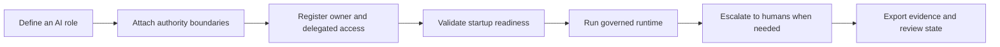
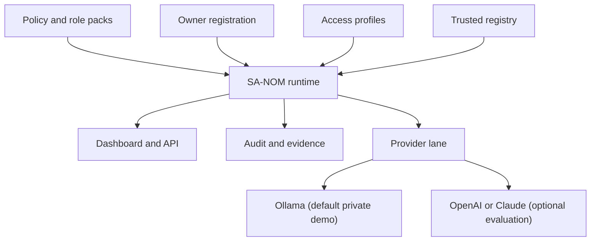

# SA-NOM AI Governance Suite

SA-NOM is a private AI operations platform for organizations that want AI in real roles, with governance built in.

Instead of treating AI as a loose chatbot or an unsafe automation layer, SA-NOM lets teams define governed AI roles, route work through authority boundaries, let humans pull reports and meetings through Human Ask, keep escalation and override paths explicit, and retain evidence for every important decision.

## What SA-NOM Actually Does

SA-NOM helps organizations move from "AI that answers" to "AI that works inside the business."

With SA-NOM, teams can:
- define AI roles with explicit responsibilities and allowed authority
- route work through approval, escalation, and reporting paths
- keep human override available for sensitive or ambiguous decisions
- maintain evidence, audit context, and deployment readiness records
- run the whole stack in private infrastructure controlled by the organization

The result is not only safer AI. It is AI that can participate in operations, coordination, and managed execution without falling outside organizational control.

## Why Teams Use SA-NOM

Organizations do not only need AI governance. They need AI that can actually operate.

SA-NOM is designed for teams that want to:
- assign AI to real work, not just experiments
- give AI bounded roles instead of broad unrestricted access
- keep reporting lines, escalation paths, and auditability intact
- deploy AI in private or air-gapped environments
- show legal, IT, audit, and leadership teams how the system stays accountable

## Product Direction

SA-NOM follows an operations-first model:
- AI takes a role
- AI works inside boundaries
- humans stay in control of escalation
- evidence stays attached to important actions
- governance, compliance, and private deployment are built in from the start

That means SA-NOM should be read as a governed AI operations system, not only as a governance utility.

## Visual Tour

### From Role Definition To Governed Runtime

### What Operators Actually Touch

### 5-Minute Product Tour

1. Register the executive owner and delegated access so the runtime has a real authority model.
2. Run `python scripts/guided_smoke_test.py --registration-code DEMO-ORG` to prepare the local baseline in one pass.
3. Inspect startup readiness and runtime smoke results in `_review/guided_smoke_test.json`.
4. Treat Ollama as the default private demo lane, then add OpenAI or Claude only when you need hosted evaluation.
5. Open the dashboard or API and review how evidence, compliance, and escalation state stay attached to live operations.

See [docs/PRODUCT_TOUR.md](docs/PRODUCT_TOUR.md) for the full walkthrough.

## Community Baseline

The public repository currently includes:
- PTAG parsing and validation
- governed runtime execution and decision flow
- audit chain and evidence-oriented execution paths
- Role Private Studio authoring flows
- Human Ask reporting and meeting workflows
- deployment readiness and operational health checks
- provider probes and demo-readiness flows for Ollama, OpenAI, and Claude
- Docker, Helm, Kubernetes, and local private-server deployment paths
- security audit and Thai regulated-deployment templates

## Open-Core Model

This repository is published as the community baseline of SA-NOM under AGPL-3.0-only.

- Community: self-managed core runtime, dashboard, PTAG tooling, audit chain, deployment checks, examples, and local ops workflows
- Commercial: enterprise-only features, direct support, rollout hardening, compliance tailoring, custom integrations, and on-site enablement

If you run a modified networked version of this software, AGPL requires you to make the corresponding source available to users of that service. See [LICENSE](LICENSE) and [NOTICE](NOTICE).

See [docs/FEATURE_MATRIX.md](docs/FEATURE_MATRIX.md) for the intended open-core boundary and [docs/COMMERCIAL_LICENSE.md](docs/COMMERCIAL_LICENSE.md) for pricing and commercial terms.

## Start Here

Choose the path that matches your situation:
- Guided evaluation path: run `python scripts/guided_smoke_test.py --registration-code DEMO-ORG` for the fastest first run, then use [docs/GUIDED_EVALUATION.md](docs/GUIDED_EVALUATION.md) for the manual breakdown.
- Self-managed community path: start with the quick start below, review [docs/DEPLOYMENT.md](docs/DEPLOYMENT.md), [docs/PROVIDER_SETUP.md](docs/PROVIDER_SETUP.md), [docs/OLLAMA_DEMO_ENVIRONMENT.md](docs/OLLAMA_DEMO_ENVIRONMENT.md), [docs/DISCOVERY_DEMO.md](docs/DISCOVERY_DEMO.md), [docs/LIVE_CUSTOMER_WALKTHROUGH.md](docs/LIVE_CUSTOMER_WALKTHROUGH.md), and [docs/TROUBLESHOOTING.md](docs/TROUBLESHOOTING.md).
- Commercial path: review [docs/COMMERCIAL_LICENSE.md](docs/COMMERCIAL_LICENSE.md), use [docs/FEATURE_MATRIX.md](docs/FEATURE_MATRIX.md), [docs/COMMERCIAL_DISCOVERY_CHECKLIST.md](docs/COMMERCIAL_DISCOVERY_CHECKLIST.md), [docs/ROI_ONE_PAGER.md](docs/ROI_ONE_PAGER.md), [docs/SALES_INTAKE_TEMPLATE.md](docs/SALES_INTAKE_TEMPLATE.md), and [docs/PILOT_PROPOSAL_TEMPLATE.md](docs/PILOT_PROPOSAL_TEMPLATE.md), then contact `sanomaiarch@gmail.com`.

## Quick Start

See [`docs/README.md`](docs/README.md) for the operator, deployment, and release document index.

### Local Python runtime

Fastest first run:
- `python scripts/guided_smoke_test.py --registration-code DEMO-ORG`
- This writes `_review/guided_smoke_test.json`, prepares the local runtime artifacts, runs startup validation, and finishes with the end-to-end smoke test.
- For a real private-model demo lane, follow with `python scripts/ollama_demo_environment.py`.

Manual path:
1. Use Python 3.14 or newer.
2. Create a local environment file from [`.env.production.example`](.env.production.example) or export the variables directly.
3. Register an organization owner:
   - `python scripts/register_owner.py --registration-code DEMO-ORG`
4. Generate delegated access profiles:
   - `python scripts/bootstrap_access_profiles.py --output _runtime/access_profiles.json --tokens-output _runtime/generated_access_tokens.json`
5. Run a startup validation:
   - `python scripts/dashboard_server.py --check-only`
6. Run the smoke tests:
   - `python scripts/private_server_smoke_test.py`
   - `python scripts/provider_smoke_test.py`
   - `python scripts/provider_smoke_test.py` returning `disabled` is expected until a provider is configured
7. Prepare the real private Ollama demo lane when you want live local inference:
   - `python scripts/ollama_demo_environment.py`
   - `python scripts/provider_demo_flow.py --provider ollama --probe`
   - OpenAI and Claude remain optional hosted evaluation lanes; see [docs/PROVIDER_SETUP.md](docs/PROVIDER_SETUP.md) and [docs/OLLAMA_DEMO_ENVIRONMENT.md](docs/OLLAMA_DEMO_ENVIRONMENT.md).
8. Start the server:
   - `python scripts/run_private_server.py --host 127.0.0.1 --port 8080`

If startup validation or smoke tests fail, go to [docs/TROUBLESHOOTING.md](docs/TROUBLESHOOTING.md).

### Docker

1. Review [docs/DEPLOYMENT.md](docs/DEPLOYMENT.md) and [docs/KUBERNETES.md](docs/KUBERNETES.md).
2. Set the required environment variables.
3. Start the containerized runtime:
   - `docker compose up --build`
4. If you want the default private-model demo lane with Ollama:
   - `docker compose --profile local-llm up --build`

## Current Release

- Current public release: [v0.1.3](https://github.com/sanom-ai/sa-nom-ai-governance-suite/releases/tag/v0.1.3)
- Release notes: [docs/releases/RELEASE_NOTES_v0.1.3.md](docs/releases/RELEASE_NOTES_v0.1.3.md)
- Release roadmap archive: [docs/ROADMAP_v0.1.1.md](docs/ROADMAP_v0.1.1.md)
- Backlog seeds: [docs/BACKLOG_SEEDS.md](docs/BACKLOG_SEEDS.md)

## Public Docs

- [docs/GUIDED_EVALUATION.md](docs/GUIDED_EVALUATION.md): fastest first-run path for evaluators, including the one-command smoke helper
- [docs/TROUBLESHOOTING.md](docs/TROUBLESHOOTING.md): recovery steps for common startup and provider issues
- [docs/FAQ.md](docs/FAQ.md): AGPL, self-hosting, and commercial-boundary answers
- [docs/PROVIDER_SETUP.md](docs/PROVIDER_SETUP.md): provider configuration, probe flow, and demo artifact path
- [docs/OLLAMA_DEMO_ENVIRONMENT.md](docs/OLLAMA_DEMO_ENVIRONMENT.md): real private-model setup path for the default Ollama demo lane
- [docs/DISCOVERY_DEMO.md](docs/DISCOVERY_DEMO.md): short customer demo runbook for provider-backed evaluations
- [docs/LIVE_CUSTOMER_WALKTHROUGH.md](docs/LIVE_CUSTOMER_WALKTHROUGH.md): sales-oriented live talk track for customer demos using the default private Ollama lane
- [docs/LIVE_CUSTOMER_WALKTHROUGH_TH.md](docs/LIVE_CUSTOMER_WALKTHROUGH_TH.md): Thai live talk track for customer demos using the default private Ollama lane
- [docs/PRODUCT_TOUR.md](docs/PRODUCT_TOUR.md): visual walkthrough of the operator journey, runtime shape, and first demo flow
- [docs/LEGAL_REVIEW_ROLE_PACK.md](docs/LEGAL_REVIEW_ROLE_PACK.md): pilot-ready public-safe legal role pack for contract review and escalation demos
- [docs/HR_POLICY_ROLE_PACK.md](docs/HR_POLICY_ROLE_PACK.md): pilot-ready public-safe HR role pack for policy exceptions, employee-case routing, and human approval boundaries
- [docs/PURCHASING_SUPPLIER_RISK_ROLE_PACK.md](docs/PURCHASING_SUPPLIER_RISK_ROLE_PACK.md): pilot-ready public-safe purchasing role pack for supplier risk, lead-time exposure, and governed exception routing
- [docs/FINANCE_BUDGET_VARIANCE_ROLE_PACK.md](docs/FINANCE_BUDGET_VARIANCE_ROLE_PACK.md): pilot-ready public-safe finance role pack for budget posture, cost variance, and governed exception routing
- [docs/FINANCE_BUDGET_VARIANCE_SCENARIO.md](docs/FINANCE_BUDGET_VARIANCE_SCENARIO.md): guided finance workflow story for budget exceptions, cost variance, and human-gated finance approvals
- [docs/ACCOUNTING_CLOSE_EXCEPTION_ROLE_PACK.md](docs/ACCOUNTING_CLOSE_EXCEPTION_ROLE_PACK.md): pilot-ready public-safe accounting role pack for close readiness, reconciliation exceptions, and governed period-end routing
- [docs/BANKING_TREASURY_CONTROL_ROLE_PACK.md](docs/BANKING_TREASURY_CONTROL_ROLE_PACK.md): pilot-ready public-safe banking and treasury role pack for payment-batch review, bank-file control, and governed release routing
- [docs/NEW_MODEL_LAUNCH_READINESS_ROLE_PACK.md](docs/NEW_MODEL_LAUNCH_READINESS_ROLE_PACK.md): pilot-ready public-safe NPI role pack for launch readiness, trial-build exceptions, and governed new-model escalation
- [docs/NEW_MODEL_LAUNCH_READINESS_SCENARIO.md](docs/NEW_MODEL_LAUNCH_READINESS_SCENARIO.md): guided NPI workflow story for launch readiness, APQP exceptions, and human-gated new-model release
- [docs/WAREHOUSE_MATERIAL_SHORTAGE_ROLE_PACK.md](docs/WAREHOUSE_MATERIAL_SHORTAGE_ROLE_PACK.md): pilot-ready public-safe warehouse role pack for shortage posture, allocation exceptions, and governed stock-risk routing
- [docs/PRODUCTION_LINE_EXCEPTION_ROLE_PACK.md](docs/PRODUCTION_LINE_EXCEPTION_ROLE_PACK.md): pilot-ready public-safe production role pack for line stoppage review, schedule-recovery routing, and governed manufacturing escalation
- [docs/PRODUCTION_LINE_EXCEPTION_SCENARIO.md](docs/PRODUCTION_LINE_EXCEPTION_SCENARIO.md): guided production workflow story for line stoppage, recovery risk, and human-gated schedule escalation
- [docs/DEPLOYMENT.md](docs/DEPLOYMENT.md): public deployment guide
- [docs/KUBERNETES.md](docs/KUBERNETES.md): Helm chart and raw Kubernetes deployment guide
- [docs/FEATURE_MATRIX.md](docs/FEATURE_MATRIX.md): community vs commercial boundary
- [docs/COMMERCIAL_LICENSE.md](docs/COMMERCIAL_LICENSE.md): pricing, support tiers, and buying path
- [docs/COMMERCIAL_DISCOVERY_CHECKLIST.md](docs/COMMERCIAL_DISCOVERY_CHECKLIST.md): qualification checklist for the first serious commercial conversation
- [docs/DEMO_CHECKLIST.md](docs/DEMO_CHECKLIST.md): one-page checklist for running a live customer demo without losing the story
- [docs/DEMO_CHECKLIST_TH.md](docs/DEMO_CHECKLIST_TH.md): one-page Thai demo checklist for live customer calls
- [docs/ROI_ONE_PAGER.md](docs/ROI_ONE_PAGER.md): executive-facing business-value framing for pilots, rollouts, and budget conversations
- [CONTRIBUTING.md](CONTRIBUTING.md): development workflow and contribution rules
- [SECURITY.md](SECURITY.md): vulnerability disclosure policy
- [docs/SECURITY_AUDIT_CHECKLIST.md](docs/SECURITY_AUDIT_CHECKLIST.md): production security and release checklist
- [docs/TRADEMARKS.md](docs/TRADEMARKS.md): brand and naming guidance
- [NOTICE](NOTICE): project-specific license, trademark, and commercial notice
- [docs/SUPPORT.md](docs/SUPPORT.md): community, commercial, and security contact path
- [templates/compliance/README.md](templates/compliance/README.md): Thai banking and government compliance starter templates
- [docs/ONE_PAGER.md](docs/ONE_PAGER.md): concise product and commercial summary aligned with the public repo
- [docs/ONE_PAGER_TH.md](docs/ONE_PAGER_TH.md): Thai one-pager for customer-facing sales conversations
- [docs/OPEN_SOURCE_RELEASE_CHECKLIST.md](docs/OPEN_SOURCE_RELEASE_CHECKLIST.md): launch checklist for publishing a clean public release
- [docs/PUBLIC_UPLOAD_RUNBOOK.md](docs/PUBLIC_UPLOAD_RUNBOOK.md): step-by-step upload procedure for the first public push
- [docs/SALES_INTAKE_TEMPLATE.md](docs/SALES_INTAKE_TEMPLATE.md): intake template for commercial inquiries
- [docs/GITHUB_OPERATIONS_PLAYBOOK.md](docs/GITHUB_OPERATIONS_PLAYBOOK.md): GitHub setup, milestone, label, and repo-positioning guidance
- [docs/ISSUE_DRAFTS_v0.1.1.md](docs/ISSUE_DRAFTS_v0.1.1.md): ready-to-use issue drafts for the first post-launch milestone

## Repository Layout

- `sa_nom_governance/`: main Python package grouped by domain (`api`, `audit`, `compliance`, `core`, `dashboard`, `deployment`, `guards`, `human_ask`, `integrations`, `ptag`, `studio`, `utils`)
- `scripts/`: operational entrypoints such as `scripts/dashboard_server.py`, `scripts/run_private_server.py`, `scripts/provider_smoke_test.py`, `scripts/provider_demo_flow.py`, and `scripts/ollama_demo_environment.py`
- `_support/tests/`: regression tests and fixtures
- `_runtime/`: generated local runtime state only; do not commit real organization state
- `examples/`: sanitized example artifacts for documentation and onboarding
- `_review/`: local review outputs and handoff material

## Development

The open-source baseline currently runs on the Python standard library.

For contributor tooling:
- `python -m pip install -r requirements-dev.txt` or `python -m pip install -e .[dev]`
- `python -m pytest _support/tests`
- `python scripts/provider_smoke_test.py` when validating provider wiring
- `python scripts/provider_demo_flow.py --provider ollama --probe` when validating the default private demo lane

GitHub Actions CI is configured in [`.github/workflows/ci.yml`](.github/workflows/ci.yml).

## Security and Sensitive Data

- Never commit real `_runtime/` data, generated access tokens, or organization-specific secrets.
- Treat `_runtime/generated_access_tokens.json` as secret output.
- Use the files in `examples/` for documentation, demos, and onboarding.
- Report vulnerabilities privately to `sanomaiarch@gmail.com`.

## Contact

Community, commercial, security, and evaluation contact:
`sanomaiarch@gmail.com`

