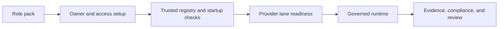

# Product Tour

Use this guide when you want a compact walkthrough of how SA-NOM moves from role definition to governed runtime execution.

## What This Tour Shows

SA-NOM is not only a control layer around AI.
It is a runtime for organizations that want AI to hold a role, stay inside boundaries, escalate when necessary, and leave evidence behind.

## Tour Map

## 1. Role Packs And Policy Shape

Start with the PTAG role packs under `resources/roles/`.
They define the boundaries the runtime will respect before any provider is called.

Look at:
- `resources/roles/GOV.ptn`
- `resources/roles/LEGAL.ptn`
- `resources/config/role_transition_matrix.json`

This is the layer that turns AI from a general assistant into a governed operating role.

See [PTAG_FRAMEWORK.md](PTAG_FRAMEWORK.md).

## 2. Owner And Delegated Access

The runtime becomes organization-aware once an executive owner and delegated profiles are present.

Fastest path:
- `python scripts/guided_smoke_test.py --registration-code DEMO-ORG`

Manual path:
- `python scripts/register_owner.py --registration-code DEMO-ORG`
- `python scripts/bootstrap_access_profiles.py --output _runtime/access_profiles.json --tokens-output _runtime/generated_access_tokens.json`

This creates the authority surface the dashboard and API will use.

## 3. PT-OSS Structural Intelligence

Before a role is treated as publication-ready or structurally trustworthy, SA-NOM already carries a PT-OSS layer that can apply structural posture, readiness scoring, blockers, and recommendations.

That means the product is not only checking whether the runtime starts. It is also checking whether the role and workflow are structurally safe enough to trust.

SA-NOM includes PT-OSS as an embedded structural intelligence layer.

PT-OSS is a creator-developed embedded framework integrated into SA-NOM to assess structural dependency, fragility, human-override integrity, and power asymmetry before AI roles and workflows are treated as safely governed.

See [PT_OSS_CORE.md](PT_OSS_CORE.md) and [PT_OSS_METRICS.md](PT_OSS_METRICS.md).

## 4. Trusted Registry And Startup Readiness

Before the runtime is treated as ready, SA-NOM verifies owner identity, delegated access, registry state, and session posture.

Run:
- `python scripts/dashboard_server.py --check-only`

The one-command guided flow also writes:
- `_review/guided_smoke_test.json`

That report is the fastest way to show a stakeholder that the runtime is prepared before go-live.

## 5. Provider Lane Strategy

SA-NOM separates runtime governance from model-provider choice.

Default private demo lane:
- Ollama

Optional hosted evaluation lanes:
- OpenAI
- Claude

Private-first probe flow:
- `python scripts/provider_demo_flow.py --provider ollama --probe`

This keeps the product story aligned with private AI operations while still allowing hosted evaluation when needed.

## 6. Governed Document Center

Beyond runtime execution, SA-NOM can also be read as the foundation for a governed document system.

The Governed Document Center is the layer for creating, organizing, approving, publishing, and retaining policies, standards, procedures, forms, templates, and records under role-based authority and audit-ready control.

The operating model stays the same:
- AI should do routine document work inside approved boundaries
- humans should step in only when approval, exception handling, or higher-risk control decisions are required

See [GOVERNED_DOCUMENT_CENTER.md](GOVERNED_DOCUMENT_CENTER.md).

## 7. Runtime, Escalation, And Evidence

Once the baseline is prepared, the runtime can expose dashboard, health, evidence, integration, and provider surfaces in one governed path.

Run:
- `python scripts/private_server_smoke_test.py`
- `python scripts/run_private_server.py --host 127.0.0.1 --port 8080`

The important point in a demo is not only that the runtime answers.
It is that the runtime shows:
- ownership
- delegated authority
- escalation-aware behavior
- evidence export
- provider posture
- compliance alignment

## 8. Flagship Capability Proof Surface

By the `v0.7.1` line, the strongest operator-proof story is not one isolated feature.
It is the way eight governed surfaces reinforce each other:

- `Role Private Studio` turns job intent into revision-aware, publication-aware governed roles.
- `Human Ask` lets humans pull governed reporting with freshness and confidence posture visible.
- `PT-OSS Structural Intelligence` shows whether a role or workflow is structurally healthy enough to trust.
- `Authority Guard + Resource Lock` keeps action decisions and conflict recovery explicit.
- `Audit Chain + Evidence Pack` keeps verification and review anchored in tamper-evident evidence.
- `Trusted Registry` keeps published roles tied to explicit organizational trust.
- `Integration Outbound` gives runtime events a webhook-first path into SIEM, chat-ops, ticketing, and custom systems.
- `Human Alert + Escalation Notification` keeps blocked, guarded, and human-required posture visible to operators.

These are not separate product families.
They are one governed operating path viewed from different operator needs.

See [FEATURE_MATRIX.md](FEATURE_MATRIX.md) for the current boundary language and [GOVERNED_HITL_OPERATIONS.md](GOVERNED_HITL_OPERATIONS.md) for the operator-oriented HITL model.

## Best Demo Order

1. Run `python scripts/guided_smoke_test.py --registration-code DEMO-ORG`.
2. Show `_review/guided_smoke_test.json`.
3. Run `python scripts/provider_demo_flow.py --provider ollama --probe` if a local model is ready.
4. Run `python scripts/private_server_smoke_test.py`.
5. Open the runtime and explain the dashboard, evidence, and go-live readiness surfaces.

## Where To Go Next

- [GUIDED_EVALUATION.md](GUIDED_EVALUATION.md)
- [DISCOVERY_DEMO.md](DISCOVERY_DEMO.md)
- [PROVIDER_SETUP.md](PROVIDER_SETUP.md)
- [DEPLOYMENT.md](DEPLOYMENT.md)

